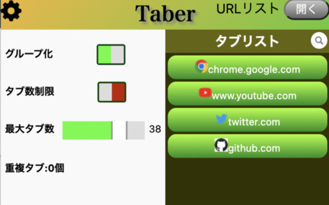

# Taber

タブ整理Chrome拡張機能
[chromeウェブストア](https://chromewebstore.google.com/detail/taber/cbfbjkdodflcnidgamdjnmochcmchopl?hl=ja&utm_source=ext_sidebar)

## 主な機能

- タブ数制限
- タブのグループ化
- 重複タブの削除

## 使用技術

- javascript
    - Chrome Extension API
    - jQuery
- HTML
- CSS

## 開発メンバー

- [simeiro](https://github.com/simeiro)
- [Fuma](https://github.com/Fuma820)
- [jimicho](https://github.com/jimicho)
- [ficia](https://github.com/fecia)
